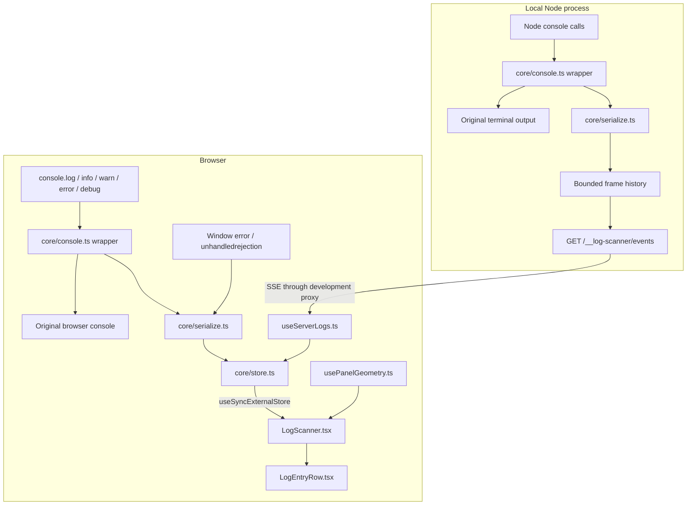

# logscan: architecture and code walkthrough

This guide explains how the current implementation is assembled, how data moves through it, and what each project file owns. For installation and application examples, start with [README.md](./README.md).

Source paths in this document refer to the repository checkout. The package archive contains the built `dist/` output and documentation, not the example or test sources.

## Contents

- [Design and technology](#design-and-technology)
- [Architecture](#architecture)
- [The log entry contract](#the-log-entry-contract)
- [Console interception](#console-interception)
- [Safe argument snapshots](#safe-argument-snapshots)
- [The bounded store](#the-bounded-store)
- [Browser capture and visibility](#browser-capture-and-visibility)
- [React rendering and interaction](#react-rendering-and-interaction)
- [Moving and resizing](#moving-and-resizing)
- [Node capture and streaming](#node-capture-and-streaming)
- [Receiving server logs](#receiving-server-logs)
- [Resource ownership and cleanup](#resource-ownership-and-cleanup)
- [Build and package boundaries](#build-and-package-boundaries)
- [File-by-file guide](#file-by-file-guide)
- [Verification and making changes](#verification-and-making-changes)

## Design and technology

The project is built in layers so capture does not depend on the panel being open:

1. Define a shared entry format and bounded serializer.
2. Intercept console calls while preserving existing output.
3. Store immutable browser snapshots independently of React.
4. Connect React through an external-store subscription and add the floating controls.
5. Instrument Node separately and transport entries over HTTP SSE.
6. Integrate both paths in a React/Express playground.
7. Build separate package entries and verify them in independent consumer apps.

Dragging, resizing, the inline logo, and the `visible` master switch build on these boundaries: geometry stays in the UI layer; visibility controls capture ownership as well as rendering.

| Technology | Role and reason |
| --- | --- |
| React 18.3 / 19 | Functional UI components and effects. `useSyncExternalStore` integrates the capture store without putting logging inside React state. |
| TypeScript | Shared data contracts, strict checking, DOM/Node types, and generated public declarations. |
| Tailwind CSS 4 | Compile package utilities with the `ls:` prefix. Omit Preflight to avoid resetting the consuming page. |
| `clsx` | Conditional classes for log levels, connection state, and interaction state. |
| `react-error-boundary` | Contain panel rendering failures and offer a retry UI. |
| Browser Pointer Events | Drag/resize with pointer capture and explicit cancellation; no drag library. |
| Native `EventSource` | Receive one-way server events with browser-managed reconnection and last-event IDs. |
| Node HTTP interfaces | A framework-independent request handler; no server is started by the adapter. |
| Express 5 and `tsx` | Run the example backend in TypeScript. Express is not a runtime dependency of the published library. |
| Vite 8 | Build the example and separate ESM library entries and compile CSS. Build configuration uses `rolldownOptions`. |
| Vitest, Testing Library, jsdom | Test core algorithms, lifecycle behavior, React interactions, and geometry. |
| Playwright | Exercise the real playground in Chromium, including streaming, clipboard, layout, dragging, and resizing. |
| Node verification script | Install the packed build in React 18/19 consumers and inspect type resolution, dependency sharing, assets, and browser output. |

Exact dependency ranges and commands are maintained in `package.json`; resolved versions are recorded in `package-lock.json`.

## Architecture



The same core modules are bundled into two different runtime environments. Browser and Node do **not** share a JavaScript store or global registry across processes. Their common entry contract lets the browser merge entries after transport.

Browser capture is shared within one browser global environment. Each Node adapter has its own history and clients, while adapters in the same process share low-level console interception.

## The log entry contract

Defined in `src/core/types.ts`:

```ts
interface LogEntry {
  readonly id: string;
  readonly timestamp: number;
  readonly level: 'log' | 'info' | 'warn' | 'error' | 'debug';
  readonly source: 'browser' | 'server';
  readonly args: readonly string[];
  readonly message: string;
}
```

| Field | Meaning |
| --- | --- |
| `id` | Source + runtime session prefix + increasing counter. The identity registry survives module reloads in that runtime. |
| `timestamp` | `Date.now()` in milliseconds when the entry is created. |
| `level` | One of the five intercepted method names. |
| `source` | Where capture happened, not where the entry is displayed. |
| `args` | Immediate textual snapshots, one per captured argument, possibly followed by a truncation marker. |
| `message` | `args.join(' ')`; used by search, row previews, and copying. |

Entries and their argument arrays are frozen. Original application objects are not retained in history. Mutating an object after logging it cannot change the saved preview.

The store preserves **arrival order**. Server timestamps can differ from the browser clock, so sorting timestamps would produce a misleading merged sequence. IDs identify entries; they are not authentication tokens or a permanent ordering protocol.

## Console interception

`src/core/console.ts` exports the internal `installConsoleCapture(target, listener)` helper. Both browser and Node adapters use it.

1. Find a `WeakMap` on `globalThis` under `Symbol.for('log-scanner.console-captures.v1')`.
2. Look up the target console. For a new target, save all original methods before installing wrappers.
3. Register the caller's listener with a unique token. Multiple callers share the wrappers.
4. On each call, invoke the original method first, with its original target and unchanged arguments.
5. Unless already delivering a captured call, notify the current listeners.
6. Return an idempotent cleanup function that releases only that caller's token.

The original return value is preserved. If the original method throws, that exception propagates and capture is not reached. A `busy` flag prevents a log emitted during capture from recursively capturing itself; its normal console output still occurs.

Subscriber failures are isolated and reported through the saved original `console.error`, avoiding recursive collection. Read-only console methods are left intact, so those methods may not be captured.

When the final listener leaves, restore a method **only if the current method is still this wrapper**. A later console integration must remain installed. `Symbol.for` registry reuse is also why hot reload can reuse interception without repeatedly stacking active wrappers.

## Safe argument snapshots

`src/core/serialize.ts` implements `createLogEntry(source, level, values)`. It traverses arguments into a `PreviewWriter` instead of blindly stringifying arbitrary application values.

| Bound | Current value |
| --- | --- |
| Combined argument-preview budget | 7,800 bytes, counting JSON escapes and UTF-8 expansion |
| Input arguments inspected | At most 64; an extra truncation-marker preview can produce 65 output strings |
| Nesting depth | Depth 5 becomes `[Max depth]` |
| Children per collection | At most 40 enumerable object/array children or Map/Set items |
| Complete generated JSON entry | Below 16 KiB, allowing for duplicated `message` text and metadata |

`takeBytes` counts escaped control characters, quotes, backslashes, Unicode, and lone surrogates. The budget is based on transport cost, not just JavaScript string length. Each argument consumes the remaining shared budget; an unusually large first argument can leave no room for later ones.

Representation rules:

- Top-level strings stay unquoted; nested strings are quoted and escaped.
- Primitive values become text; bigint gets an `n` suffix and functions become `[Function]`.
- A recursion-path `WeakSet` detects cycles as `[Circular]`. Removing objects on return allows a shared object used in separate branches to be shown again.
- Data properties are read through descriptors; accessors appear as `[Getter]` or `[Setter]` instead of invoking ordinary getters. `toJSON()` is not used.
- Errors include name/message, available stack, and an own data-property `cause`.
- Dates use ISO strings; invalid dates become `[Invalid Date]`.
- Maps and sets use bounded readable previews through their native iterators.
- Failed reflection, including throwing or revoked proxies, falls back to `[Unserializable]`. Proxy traps may still execute during reflection.
- Exhausted budgets use `… [truncated]` where the available space permits it.

These previews are for inspection, not lossless serialization. They can be incomplete JSON; sparse array indices, prototypes, and ordinary non-enumerable properties are not preserved as a full object model. `%s`/`%c` console formatting is not interpreted by the panel.

## The bounded store

`src/core/store.ts` implements an immutable bounded array, not a ring buffer or database.

```text
append(entry)
  -> create a new array containing the previous entries and entry
  -> retain only the newest capacity entries
  -> freeze and replace the snapshot immediately
  -> schedule one subscriber notification batch after 16 ms
```

`normalizeMaxLogs` in `types.ts` defaults to 500, floors/clamps finite values to 1–5000, and uses 500 for non-finite inputs. Reducing capacity immediately evicts older entries.

The store exposes internal methods:

| Method | Responsibility |
| --- | --- |
| `getSnapshot()` | Return the current stable immutable array for React. |
| `getServerSnapshot()` | Return a shared empty array for server rendering. |
| `subscribe(listener)` | Register an observer and return its unsubscribe function. |
| `append(entry)` | Update history now and schedule batched delivery. |
| `clear()` | Empty history and notify, without disconnecting capture. |
| `setMaxLogs(value)` | Normalize the limit and trim if needed. |
| `dispose()` | Permanently stop the store, cancel its timer, and empty listeners/history. |

No notification timer is scheduled without listeners. The last unsubscribe cancels a pending timer; a failing listener cannot prevent the others from updating. The browser normally keeps its shared store across hide/unmount, so it does not call `dispose()` on each panel cleanup.

The store performs **no deduplication**. Browser calls, including identical calls, are legitimate separate entries. Server replay deduplication belongs to `useServerLogs.ts`.

An append copies up to the configured capacity, and serialization happens synchronously. Notification batching reduces React updates; it does not make capture free or move work to a background thread.

## Browser capture and visibility

`src/browser/index.ts` owns a global state object under `Symbol.for('log-scanner.browser-state.v1')`:

| State | Meaning |
| --- | --- |
| `store` | Shared bounded history containing browser and received server entries. |
| `users` | Number of active capture-installation leases. |
| `visible` | Gate controlling whether leased capture is attached. |
| `controllers` | Identity tokens for mounted scanner roots and their visibility values. |
| `cleanup` | Current console/window-listener cleanup, if capture is attached. |

`installBrowserCapture()` increments the lease count, optionally changes capacity, and calls `syncCapture`. Its returned cleanup decrements once. This is the public startup API; `getBrowserStore` and `registerBrowserCaptureVisibility` are internal helpers, not public root exports.

Capture is attached only when **`users > 0` and the visibility gate is true**. Attachment subscribes to the console wrapper and two window events:

- `error`: record `event.error`, or a message with filename/line/column when no error object is available.
- `unhandledrejection`: record `Unhandled promise rejection:` and the rejection reason.

Neither event's default reporting is prevented.

The gate begins true so a standalone startup installer can capture before React mounts. Every root registers an identity visibility controller. All registered controllers must be true; one false controller suspends every browser lease, including startup capture.

Removing a false controller can resume capture if the remaining controllers are all true. Removing the final controller leaves capture suspended even when a startup lease still exists. A later visible root can resume those leases. This prevents the collector continuing after the final scanner leaves.

Suspension detaches hooks but preserves the bounded store and lease counts. Cleanup tokens are idempotent, so an older cleanup cannot release a newer installation. Global state reuse preserves these rules across hot reload; initialization also fills fields missing from an older state shape.

Browser installers and visibility registration are no-ops when `window` is absent. Importing the package does not install capture. Startup calls before any installer, or calls while capture is suspended, cannot be reconstructed afterward.

## React rendering and interaction

`src/react/LogScanner.tsx` separates the public controller from `ActiveScanner`:

```text
LogScanner
  active = visible ?? enabled       (enabled defaults to false)
  register visibility ownership in an effect
  if inactive: render null
  otherwise: ErrorBoundary -> ActiveScanner

ActiveScanner
  subscribe to the shared store with useSyncExternalStore
  own a browser capture lease and optional server connection
  wait for browser mount, then portal into document.body
  always show the launcher
  render the panel and entry rows only while open
```

The portal avoids clipping by ordinary application containers. It uses a fixed overlay whose wrapper ignores pointer input; the panel and launcher explicitly accept it. It is a **nonmodal region**, so the application remains interactive and focus is not trapped.

Local state includes open/closed, search, level/source selection, and clipboard status. Geometry is owned by its hook. Closing preserves filters and geometry, clears clipboard feedback, and unmounts the rows and their disclosure/copy state. Disabling removes `ActiveScanner`, releasing its effects and resetting local state for the next activation. The shared log history has a longer lifetime.

While open, filtering combines an exact level, exact source, and case-insensitive substring match against `entry.message`. The header's error count uses all retained entries, while the footer reports matching entries versus total entries. Clear empties the entire store, not only the filtered subset.

Search receives focus after the first geometry measurement makes the panel visible. Escape or close returns focus to the launcher. The error boundary renders a retry fallback if the scanner subtree fails; it does not replace the host application's own error handling or catch every asynchronous application failure.

`followLatest` is true while the scroll position is within 32 pixels of the bottom. The following effect runs on entries, filters, opening/initial positioning, and size changes. It scrolls only while following is enabled. Changing filters or clearing re-enables it; browsing older entries leaves following off.

### Entry presentation and copying

`src/react/LogEntryRow.tsx` renders local-time timestamps, textual level/source labels, a two-line message preview, a copy button, and native `<details>` inspection. Argument blocks render only after expanding the row. Text is rendered through React; log contents are not inserted as HTML.

Copy uses `navigator.clipboard.writeText` with:

```text
[ISO timestamp] [source] [level] message
```

Each operation gets an incrementing local operation number and a symbol shared with the footer status. The active flag and operation number prevent completions from updating an unmounted/stale row; the symbol prevents an earlier copy from overwriting a later row's status. The button disables while pending. Failure produces a manual-copy message rather than logging into the collector itself.

## Moving and resizing

`src/react/usePanelGeometry.ts` owns the numeric `{ x, y, width, height }` and the active gesture. It exports internal pure helpers for initial geometry and viewport clamping, which are also tested directly.

| Geometry rule | Value |
| --- | --- |
| Initial size | Up to 640 × 512 pixels |
| Normal minimum | 320 × 280, reduced if the viewport is smaller |
| Outer gutter | 12 pixels below viewport width 640; otherwise 20, reduced for extremely small viewports |
| Bottom reserved space | Up to 56 pixels for the 48-pixel launcher and an 8-pixel gap |
| Keyboard step | 10 pixels; 1 with Shift |

Initial placement is bottom-right above the launcher. Measurement occurs in an effect while open. Before the first measurement, the panel is hidden; its focus/scroll effects wait for dimensions. Window resize clamps the retained geometry into the new available space.

The header button starts a drag, the bottom-right button resizes with the top-left anchored, and the top-left button resizes with the right/bottom anchored. All calculations clamp the full rectangle to viewport bounds. This supports growing a panel that initially touches the available right/bottom edges.

Gesture handling:

1. Accept only the primary pointer with the main button, while open and with no other active gesture.
2. Focus the handle, prevent native drag/selection behavior, and acquire pointer capture.
3. Save the starting pointer coordinates and geometry.
4. On movement, apply the delta from that start and publish a bounded rectangle.
5. On pointer up, cancel, lost capture, viewport change, close, or unmount, release capture and clear ownership.

Pointer capture keeps movement attached to the handle outside its visible bounds. The resize listener exists only while open. Arrow keys operate the focused handle; Alt/Ctrl/Meta combinations are ignored, and Escape is left for the parent to close the panel.

Refs hold the latest geometry and gesture for event handlers; state drives rendering. Inline styles contain only dynamic position/size (and initial visibility). Tailwind controls the visual styling. Geometry survives closing/reopening but resets with the active subtree and is never written to localStorage.

## Node capture and streaming

`src/node/index.ts` exposes `createNodeLogScanner(options?)`. It returns a request handler and `dispose()`; it does not create or listen on an HTTP server.

Capture starts only when `options.enabled === true` and `NODE_ENV !== 'production'`. It uses the shared console wrapper and serializer with `source: 'server'`. It does not register Node uncaught-exception handlers or alter process exit behavior.

Each captured entry becomes a pre-serialized frame:

```text
id: <entry id>
event: log
data: <JSON-encoded LogEntry>

```

The blank line terminates the SSE event. History holds these frames, trimming oldest entries beyond the normalized `maxLogs`. Connected clients receive each new frame through their own pending queue.

### HTTP gate

| Condition | Result |
| --- | --- |
| Disabled, disposed, or wrong path | 404 |
| Correct path but non-GET method | 405 with `Allow: GET` |
| Non-loopback socket, invalid/non-local Host, or disallowed Origin | 403 |
| Already 32 clients on this adapter | 503 with `Retry-After: 10` |
| Accepted request | 200, `text/event-stream; charset=utf-8` |

The path is `/__log-scanner/events`; query parameters do not change the path match. Both the actual socket address and Host must be local. Accepted loopback forms include localhost, IPv4 loopback, IPv6 `::1`, and IPv4-mapped loopback addresses.

A supplied Origin must be a local HTTP(S) origin matching the request's protocol/host/port or an entry in `allowedOrigins`. An absent Origin is accepted. Invalid/non-local allowlist entries are ignored. This is a local-development boundary, not an authentication system for a remote deployment.

Stream headers require cache revalidation, prohibit transformation, and request that proxy buffering be disabled. Allowed origins are echoed where applicable. The browser hook still requires same-origin access, so the usual integration is a development proxy.

### Replay and reconnection

The handler looks up the `Last-Event-ID` header in retained history:

- Known cursor: queue frames after that entry.
- No cursor or expired/unknown cursor: queue all currently retained frames.

The response starts with `retry: 1500` and a connected comment. Native EventSource handles retrying; a heartbeat comment is sent every 15 seconds to writable clients. The heartbeat interval is unreferenced so it alone does not keep Node alive.

Only retained frames can be replayed. A long outage may lose entries already evicted from server history; this is not durable delivery.

### Backpressure

`response.write()` returning false means the write entered Node's output buffer but more writes should wait. The adapter marks the client blocked, pauses flushing, and waits for `drain`. It does not requeue and duplicate the frame just accepted by `write()`.

Each pending queue is limited to `maxLogs`. Overflow, a write exception, an aborted request, or a 10-second write stall closes that client. Heartbeats are skipped while blocked. On `drain`, the stall timer is cleared and remaining frames flush in order. A healthy large replay can drain over multiple writes.

Cleanup removes the client, pending frames, event listeners, and stall timer. `dispose()` is idempotent and additionally releases console ownership, stops heartbeats, destroys all connected streams, and clears history.

## Receiving server logs

`src/react/useServerLogs.ts` owns one `EventSource` per active hook effect. Its dependencies are `serverUrl` and the store; changing the URL cleans up the previous connection. Closing the panel does not unmount this hook. Disabling or unmounting the scanner does.

With no URL, it reports `Browser logs only`. Otherwise, the URL must resolve to the page's HTTP(S) origin without embedded credentials. Missing EventSource support or construction failure produces an error state while browser capture remains active.

Incoming named `log` events are parsed and validated before appending:

| Field/check | Accepted form |
| --- | --- |
| Full data | String of at most 16,384 UTF-8 bytes, also prechecked by string length |
| Parsed value | Non-null, non-array object |
| `source` | Exactly `server` |
| `id` | Nonempty string, at most 160 characters |
| `timestamp` | Finite number inside JavaScript's Date range, absolute value ≤ 8.64e15 |
| `level` | One of `LOG_LEVELS` |
| `message` | String of at most 32,768 characters, still subject to the full-event byte limit |
| `args` | Array of at most 65 strings, each at most 16,384 characters |

Accepted entries are reconstructed from expected fields and frozen. Invalid JSON or invalid records are ignored and reported in the connection status; they do not become log rows.

Replay suppression uses a `Set` initially seeded from retained server rows. It remembers up to 5,000 IDs, evicting the oldest when full. The hook also checks the current shared store before appending, preventing simultaneous mounted streams from adding the same server ID twice. This is bounded duplicate suppression, not permanent event storage.

`clear()` empties the browser store but leaves this live connection's seen-ID set intact. Recreating the connection seeds from the remaining store and can replay entries that were cleared. This explains the different behavior of clearing versus reconnecting.

Connection states are `browser-only`, `connecting`, `connected`, `reconnecting`, and `error`. An EventSource error with `readyState === 2` means closed; other error events show reconnection. An activity flag prevents stale events from updating state after cleanup. Cleanup removes listeners, closes EventSource, and clears its ID set.

## Resource ownership and cleanup

| Resource | Owner | Release point |
| --- | --- | --- |
| Console wrapper subscription | Browser collector or Node adapter | Last owned listener leaves; restore only wrappers still owned |
| Browser error/rejection listeners | Shared browser capture state | Gate becomes false or final capture lease releases |
| Visibility controller token | `LogScanner` effect | Prop change or component unmount |
| React store subscription | `useSyncExternalStore` | Active subtree unmount |
| Store notification timeout | `createLogStore` | Delivery, last unsubscribe, or store disposal |
| SSE connection and client ID set | `useServerLogs` effect | URL change, disable, or active subtree unmount |
| Pointer capture and viewport listener | `usePanelGeometry` | Gesture end/cancel, close, viewport change, or unmount as applicable |
| Clipboard completion ownership | `LogEntryRow` | Operation superseded or row unmounted; the native write itself is not cancelled |
| Node pending queue and stall timer | Individual stream client | Disconnect, overflow, timeout, write failure, or adapter disposal |
| Node heartbeat and retained history | Node adapter | `dispose()` |
| Demo fetch request | Example `App` | Completion or abort on unmount |
| Demo startup capture lease | Example entry module | Vite hot disposal; root visibility can also suspend attachment |

Retained browser history intentionally outlives the UI. Node history intentionally outlives browser connections. These are separate bounded lifetimes, not evidence of active browser capture after `visible={false}`.

## Build and package boundaries

`npm run build` performs three steps in order:

```text
vite build
  -> dist/index.js and source map
  -> dist/log-scanner.css

vite build --config vite.node.config.ts
  -> dist/node.js and source map, preserving the browser output

tsc -p tsconfig.build.json
  -> declaration files under dist/types/
```

The browser build externalizes React, ReactDOM, `clsx`, and `react-error-boundary`. React/ReactDOM are peer dependencies, so consumers supply their own instance. `clsx` and `react-error-boundary` are normal package dependencies. Keeping the Node entry separate prevents importing server code into a normal browser import.

The Node build targets Node 22, externalizes `node:` imports, and sets `emptyOutDir: false` so it does not delete browser artifacts. TypeScript emits declarations only in the final step, excluding examples and tests. Source imports use `.js` extensions that resolve against TypeScript during development and remain appropriate for emitted ESM.

`src/styles.css` imports only Tailwind theme/utilities, uses the `ls:` prefix, and scans `src/react`. It omits Preflight. The compiled stylesheet is a separate export, and `package.json` marks CSS as side-effectful so consumer bundlers retain explicit stylesheet imports. The example uses an independent `demo:` prefix.

### Network capture

`src/browser/network.ts` wraps `window.fetch` and `XMLHttpRequest.prototype.open/send` behind the same ref-counted, HMR-safe registry pattern as console capture. Three constraints shape it:

1. **The caller keeps its response.** The wrapper returns the original promise and never awaits before returning. Observers attach with both fulfilment and rejection handlers, so a failing request stays rejected for the application without producing an unhandled rejection from the wrapper.
2. **Cloning is synchronous.** `planBody` decides from headers alone whether a body is worth teeing, and `response.clone()` runs inside the settle handler — registered before the caller's own handlers, so the body is still guaranteed unread. Deferring the clone would race the application's `await response.json()`.
3. **Ordering follows responses, not body reads.** Previews resolve at different speeds, so entries queue through a promise chain and each carries the timestamp of the moment its response settled. A stalled preview is abandoned after two seconds so it cannot hold up the queue, and `text/event-stream` is never read at all.

Status codes map onto levels in `createNetworkEntry`, which keeps a searchable one-line `message` while structured detail stays in `entry.network`. XHR emits synchronously from `loadend`, where a zero status means the request never completed.

### Panel geometry persistence

`usePanelGeometry` writes the rectangle to `sessionStorage` when a gesture settles rather than on every pointer sample, and reads it back when the panel next opens. Stored values are hand-editable, so they are validated as four finite numbers and then clamped to the current viewport. `src/react/session.ts` owns every storage call: disabled, partitioned, or quota-exhausted storage degrades to an in-memory session instead of preventing the panel from opening.

The collapsed state of the filter toolbar persists through the same helper. Collapsing only hides the controls — the current search, level, and source keep filtering — so the header toggle carries a dot whenever a filter is narrowing the list, and the footer's `matching / captured` count stays visible. With the toolbar collapsed there is no search field to receive focus when the panel opens, so focus moves to the log list region instead.

`boundsFor` reserves the launcher's corner on whichever edge it occupies, so a `top-*` position pushes the panel's top edge down instead of letting it slide underneath the launcher.

### Logo mark

`src/react/logo.tsx` renders the mark as inline SVG in a `LogScannerLogo` component. The package therefore ships no image file, emits no asset URL, and costs the consumer no extra request. `label` is optional: supplying it exposes `role="img"` with that accessible name, and omitting it marks the SVG `aria-hidden` for placements where nearby text already names it.

The stroke gradient's id comes from `useId()` with colons stripped, so it is unique per instance and valid inside `url(#…)`. A fixed id would repeat across the header and launcher marks and could collide with elements in the consuming page, which then decides which gradient both marks resolve to.

Both library builds disable copying the public directory, so the unused originals in `public/` never reach `dist`. To change the mark, edit the paths in `src/react/logo.tsx` and rebuild; `scripts/verify-package.mjs` asserts the stroke color appears in the built bundle and that no image files are packed.

### Package manifest and archives

`package.json` exposes the browser root, `/node`, `/styles.css`, and `/package.json`. There are no supported deep-import entry points for store, geometry, serializer, or capture internals. Root public types include `LogScannerProps`, `LauncherPosition`, `LogEntry`, `LogLevel`, `LogSource`, and `NetworkInfo`; the Node entry exports its options/adapter types.

Only `dist`, `README.md`, and `flow.md` are explicitly included by the files allowlist. npm also includes its standard manifest metadata. The manifest names the package `logscan`, sets `private: false` to permit publishing, and declares `MIT` as its license. Consumers import the browser entry from `logscan`, the Node entry from `logscan/node`, and compiled CSS from `logscan/styles.css`.

`npm pack` runs the build through `prepack`. `test:package` intentionally packs with `--ignore-scripts`, so it requires a preceding build and audits that existing output.

## File-by-file guide

Read the source in this order to follow one browser message: `types.ts` → `console.ts` → `serialize.ts` → `store.ts` → `browser/index.ts` → `LogScanner.tsx` → `LogEntryRow.tsx`. Then read `node/index.ts` and `useServerLogs.ts` for the transport path, followed by geometry and build files.

### Library source and assets

| File | Responsibility |
| --- | --- |
| `src/index.ts` | Public React entry and type exports, plus the startup capture export. Contains a client directive; does not install capture on import. |
| `src/core/types.ts` | Shared log levels, sources, entry shape, and capacity normalization. |
| `src/core/console.ts` | Global per-console wrapper registry, listener tokens, forwarding, reentrancy protection, and owned-wrapper restoration. |
| `src/core/serialize.ts` | Bounded preview writer, object traversal, error/special-value handling, IDs, timestamps, and immutable entry construction. |
| `src/core/store.ts` | Immutable bounded history, subscription snapshots, 16 ms notification batching, clear/resize/dispose. |
| `src/browser/index.ts` | Browser singleton state, startup leases, visibility controllers, console attachment, error/rejection listeners. |
| `src/node/index.ts` | Public Node API, local-access checks, frame history, SSE handler, replay, backpressure, and disposal. |
| `src/react/LogScanner.tsx` | Public props, visibility ownership, error boundary, active capture, portal, launcher, toolbar, filtering, focus, and following. |
| `src/react/LogEntryRow.tsx` | One entry's metadata/message, lazy argument inspection, clipboard operation and status ownership. |
| `src/react/useServerLogs.ts` | EventSource effect, URL checks, payload validation, duplicate suppression, connection state, and teardown. |
| `src/react/usePanelGeometry.ts` | Initial/clamped rectangles, primary-pointer ownership, drag/resize calculations, keyboard adjustments, and viewport changes. |
| `src/browser/network.ts` | Ref-counted fetch/XHR interception, body planning and preview reads, and response-ordered emission. |
| `src/react/highlight.tsx` | Token colouring for serialized previews, with a length ceiling that falls back to plain text. |
| `src/react/session.ts` | Guarded sessionStorage reads/writes shared by panel geometry and the toolbar toggle. |
| `src/react/logo.tsx` | Inline SVG brand mark with optional accessible label. |
| `src/assets.d.ts` | Type declaration for `*.css?inline` imports, including declaration-only builds without Vite client types. |
| `src/styles.css` | Prefixed library Tailwind entry with explicit component scanning and no reset. |
| `public/image-1.png`, `public/image-1(1).png` | Earlier supplied images, kept in the checkout only; no library or example source imports them and library builds do not copy this directory. |

### Playground and development scripts

| File | Responsibility |
| --- | --- |
| `examples/index.html` | HTML document, viewport metadata, React root, module entry, and page-level demo utility classes. |
| `examples/main.tsx` | Startup capture, StrictMode/error-boundary root, sample logging actions, visibility toggle, server-request UI, and an integration snippet using the package name from the manifest. |
| `examples/styles.css` | Independent `demo:` Tailwind theme/utilities, scanning the example HTML and React source. |
| `examples/server.ts` | Express on `127.0.0.1:4318`, conditional SSE route, `/api/health`, validated `/api/check`, and shutdown. |
| `examples/vite.config.ts` | Vite example root, React/Tailwind plugins, client port 5173, `/api` and `/__log-scanner` proxies, and `example-dist` output. |
| `scripts/dev.mjs` | Spawn client and server commands, inherit their output, and coordinate termination when either exits or the parent receives a signal. |
| `scripts/verify-package.mjs` | Pack the build, create isolated consumer projects, install dependencies, compile consumer types, and audit SSR/dependencies/assets/browser graphs. |

The example's startup collector runs before React mounting, with a Vite hot-disposal cleanup. `?disabled` starts without it. The root still controls any active startup lease through `visible`.

**Run server check** posts `{ message }` to `/api/check`. The browser logs outgoing data, awaits a response with an `AbortController`, logs the result, and updates its request status. The server validates the string, emits its own console calls, and returns a request ID, uptime, and Node version. Unmount aborts the browser request. SSE then delivers the server's console entries independently of the fetch response.

The example backend opts in whenever `NODE_ENV` is not production; the README's consumer example uses the stricter explicit `NODE_ENV=development` check. The library itself always requires explicit `enabled: true` and refuses capture in production.

### Build, configuration, and documentation

| File | Responsibility |
| --- | --- |
| `package.json` | Package metadata, supported imports, files allowlist, peer/runtime/dev dependencies, engines, and scripts. |
| `package-lock.json` | Resolved dependency graph used by `npm ci`. |
| `vite.config.ts` | Browser ESM/CSS build, dependency externalization, source maps, unhashed asset names, and no public-directory copying. |
| `vite.node.config.ts` | Separate Node ESM build, Node target, source maps, and preservation of existing browser output. |
| `tsconfig.json` | Strict checking across source, examples, tests, and configurations; ES2022, JSX, bundler resolution, and unchecked-index protection. |
| `tsconfig.build.json` | Source-only declaration emission to `dist/types`, using consumer-relevant types. |
| `vitest.config.ts` | Unit test matching, default Node environment, React transform, mock cleanup, and test timeout. DOM suites select jsdom in their files. |
| `playwright.config.ts` | Single-worker Chromium setup, demo server startup/reuse, base URL, and failure screenshots/traces. |
| `.gitignore` | Ignore dependencies, builds, archives, coverage, browser results, consumer fixtures, and OS metadata. |
| `README.md` | Consumer-facing setup, API, operation, limitations, troubleshooting, and commands. |
| `flow.md` | This implementation and maintenance guide. |

### Tests

| File | What it verifies |
| --- | --- |
| `tests/core.test.ts` | Bounded snapshots, unusual values/proxies, wire-size limits, immutable IDs/text, store batching, wrappers, reentrancy, and module reload behavior. |
| `tests/browser.test.ts` | Startup leases, window events, repeated cleanup, hot reload, visibility suspension/resumption, and final-root teardown. |
| `tests/react.test.tsx` | Logo launcher, launcher position and stacking, prop precedence, disabled/SSR behavior, StrictMode, filters/focus/colouring, stream validation/replay, clipboard races, and scrolling. |
| `tests/geometry.test.tsx` | Viewport bounds, launcher-corner docking, keyboard steps, anchored resizing, pointer cancellation, stored-rectangle restore and rejection, and listener/capture cleanup. |
| `tests/network.test.ts` | Request description, status-to-level grading, untouched caller bodies, non-text and cross-origin handling, shared patches, and observer isolation. |
| `tests/node.test.ts` | Real HTTP streaming, opt-in/production guards, local-access rejection, history/cursors, shared interception, client disposal, queue overflow, and healthy replay draining. |
| `e2e/scanner.spec.ts` | Real playground integration: capture, server source filtering, copy/inspection, history/scrolling, disabled mode, mobile layout, logo, drag/resize, and keyboard behavior. Also writes screenshots. |

### Generated files

| Path | Contents and lifecycle |
| --- | --- |
| `node_modules/` | Installed dependencies; recreated by package installation. |
| `dist/` | Built package JavaScript, CSS, declarations, and maps. Regenerate with `npm run build`. |
| `example-dist/` | Production example build. |
| `artifacts/consumer-react18/` and `artifacts/consumer-react19/` | Generated independent package-consumer fixtures and their browser builds/module graphs. |
| `artifacts/*.tgz` | Verification archives, including content-hash-named copies to avoid stale local dependency caches. |
| `artifacts/*.png` | Playground screenshots written by E2E tests. |
| `test-results/` | Playwright run state, including `.last-run.json`, and failure artifacts when present. |
| `coverage/`, `playwright-report/` | Ignored output locations if coverage/reporting is enabled; ordinary test commands do not necessarily produce them. |

Edit source and configuration rather than generated output.

## Verification and making changes

### Why the checks are separated

Unit tests cover deterministic serialization, capture ownership, and effect/gesture lifecycles. Node tests use HTTP to exercise actual response behavior. Browser tests verify behavior that simulated DOM environments cannot establish reliably, such as pointer capture, focus after layout, clipboard access, and viewport sizing.

The packed-package check verifies a different boundary: code working from the repository does not prove that exported files, declarations, peer dependencies, or assets work after installation elsewhere.

`scripts/verify-package.mjs`:

1. Requires an existing `dist` build and checks that the inline SVG mark is present in the bundle and not an embedded data URL.
2. Packs with scripts disabled, checks required archive files, and rejects bundled dependencies or any packed image file.
3. Creates a content-hash-named archive so npm cannot reuse a previous archive of the same package version.
4. Generates separate React 18.3.1 and locally installed React 19 consumer projects under `artifacts/`.
5. Installs each consumer and typechecks with both Bundler and NodeNext module resolution, with `skipLibCheck: false`.
6. Checks that the scanner, error boundary, and host resolve the same React/ReactDOM installations.
7. Imports/renders on the server to confirm no browser interception or rendered panel, and checks disabled/production Node behavior.
8. Builds a consumer without Tailwind, inspects its module graph for Node leakage or extra React installations, and verifies that it emits the original PNG. Browser/Node entry checks use the installed package's resolved paths, so they follow package renames automatically.

The package fixtures currently exercise the legacy `enabled` prop. `visible` precedence and browser shutdown are covered by dedicated React/browser tests. Neither smoke builds nor unit tests replace the real browser interaction tests.

For a complete local verification:

```sh
npm ci
npx playwright install chromium
npm run check
```

This runs typecheck, unit tests, library build, E2E tests, and packed-consumer checks. Local HTTP access is needed for server tests, and uncached consumer installs require registry access. Outside CI, Playwright reuses already-running example servers; ensure those servers contain the current source.

### Where to change behavior

| Desired change | Start here | Preserve or verify |
| --- | --- | --- |
| New log level | `core/types.ts` | Wrapper methods, row styles, filters, incoming validation, and tests must agree. |
| Different preview format/limit | `core/serialize.ts` | Wire-size bound, getter handling, unusual values, and client validation compatibility. |
| Different history policy | `core/store.ts` and Node frame history | Immutable stable snapshots, capacity bounds, notification batching, and replay behavior. |
| Visibility/lifetime behavior | `browser/index.ts` and `LogScanner.tsx` | Startup leases, StrictMode, HMR, existing history, and cleanup ownership. |
| Panel appearance | React component classes and `src/styles.css` | Prefixed styles, no reset, labels/focus, and narrow resized layouts. |
| Drag/resize behavior | `usePanelGeometry.ts` | Anchored edges, tiny viewports, keyboard parity, single-pointer ownership, and teardown. |
| Stream protocol | `node/index.ts` and `useServerLogs.ts` together | Matching shape/limits, cursor replay, bounded duplicate tracking, backpressure, and cleanup. |
| Public exports or build assets | `src/index.ts`, Node entry, manifest, build configs | Declarations, archive contents, consumer imports, and one shared React instance. |

Core capture code deliberately avoids routine debug logging into intercepted methods. Reentrant capture, repeated connection failures, and subscriber failures can otherwise generate noisy feedback or hide the original problem. Use isolated tests and the existing original-console reporting path when investigating that layer.

There is no row virtualization, persistence layer, network inspector, subprocess collector, or Pino/Winston bridge in this version. Those features would require explicit new boundaries and tests; the current bounded array and lazy argument rendering serve the local console use case.
